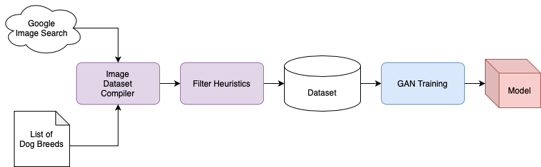
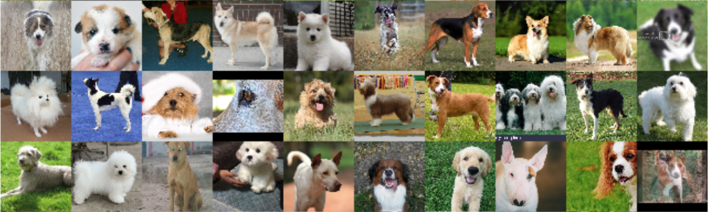
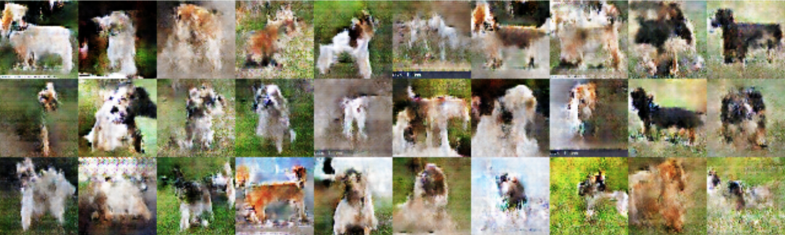

# Dog Generator
Source code of my semester project for the subject `redes neuronales artificiales`.

## Objective
As a self chosen objective, I decided to explore generative models such as `DCGAN` and `Wasserstein GAN` to generate photo-realistic dog images using modelling techniques as proposed by [[Radford2015](https://arxiv.org/pdf/1511.06434.pdf)] and [[Arjovsky2017](https://arxiv.org/pdf/1701.07875.pdf)].

## Architecture
Using the Wikipedia page on [dog breeds](https://en.wikipedia.org/wiki/List_of_dog_breeds) it was possible to create a comprehensive list of all known dog breeds. From there, the following workflow as displayed in `Figure 1` was setup to create different model iterations. For detailed information on the model architectures check the [project report](https://github.com/chrismolli/dog_generator/blob/master/report/report_neural_networks_english.pdf). The pipeline executes the following steps.

- Use the for this purpose made [`ImageDatasetCompiler`](https://github.com/chrismolli/ImageDatasetCompiler) to download a hundred images per keyword (here per dog breed) from Google Image Search.
- Crop, resize and filter results to create a image dataset.
- Employ GPU-accelerated Jupyter Notebooks to train and evaluate chosen model variants.
- Sample images from generated models.

  Figure 1: Data acquisition and modelling pipeline. 
  

In `Figure 2` you may see samples from the obtained training dataset. The dataset was filtered using explicit heuristics to omit cartoon-like images as well as shots taken in a studio environment (white back-drop).

  Figure 2: Samples from the acquired dataset. 
  

## Results
The results are discussed in detail in my report, which is available in both, [English](https://github.com/chrismolli/dog_generator/blob/master/report/report_neural_networks_english.pdf) and [Spanish](https://github.com/chrismolli/dog_generator/blob/master/report/memoria_redes_neuronales_espanol.pdf). In `Figure 3` you may see samples from the trained `DCGAN` model after training. Further training resulted in mode collapse of the model.

  Figure 3: Samples from the obtained DCGAN model. 
  

Training of the `DCGAN` and `WGAN` models did not yield a generative model that is able to fully reproduce photo-realistic dog images, but the models are able to infer certain traits of the targeted species. Characteristics like silhouette, parts of faces, legs and different furs are learned and can be generated. A promising next step to further improve the model performance could be the use of Spectral Weight Normalization (see [[Miyato2018](https://arxiv.org/pdf/1802.05957.pdf)]]) to increase stability over longer periods of training or the improved `WGAN` architecture as described in [[Gulrajani2017](https://arxiv.org/pdf/1704.00028.pdf)], that avoids clipping of the critic’s weights. Since the training was in general very computational expensive, even using the free GPU of Google Colab, the investigation in these models was a rather slow process, limiting my ability to fully search the hyperparameter and model space.
